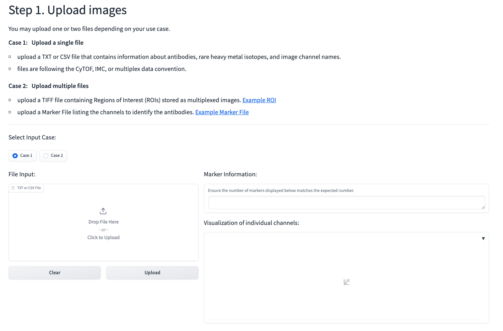

# Introduction
**Multi**plexed **T**issue **A**nalysis **P**latform (MultiTAP) is an open-source Python package designed for analyzing multiplexed tissue images. Package functionalities include the quantification of single-cell biomarkers, cell type clustering, and the analysis of cell-cell interactions. MultiTAP addresses a critical gap between the existing software landscape and the exponentially increasing volume of multiplexed tissue image data, by providing comprehensive and user-friendly tools tailored specifically for analyzing multiplexed data representations. Compared with previous software, MultiTAP offers unique features and advantages. It incorporates a cell segmentation algorithm guided by cytoplasm membrane labels, provides downstream analysis methods such as data normalization and automatic identification of marker-positive cells, and enables co-expression and cell-cell spatial interaction analysis. Moreover, MultiTAP offers the convenience of end-to-end analysis with a GUI for users from diverse backgrounds. 

A workflow of MultiTAP is shown here: 

# Citation
If you find any of the tools in this repository useful, please cite us:
TBD.

# Getting started
The most straightforward access to multiTAP is through our graphical user interface (GUI):
- https://ai.swmed.edu/projects/multitap/ is an informative website that includes both an introduction and analysis tool to multiTAP. 
- https://huggingface.co/spaces/QBRC/multiTAP is a space hosted on :hugs: if you need to access multiTAP execution logs.

The links above should open to the following analysis page:



In this tutorial, we will utilize a publicly available breast cancer dataset containing 352 patients sourced from University Hospital Basel and University Hospital Zurich (original paper [here](https://pubmed.ncbi.nlm.nih.gov/31959985/)).

ROI `BaselTMA_SP43_25.8kx22ky_10500x6500_8_20170928_114_115_X4Y8_262_a0_full` is used. For convenience, you may download this ROI at https://qbrc.swmed.edu/labs/xiaoxie/download/multiplex/example_image.tiff

TIFF files contain Regions of Interest (ROIs) stored as multiplexed images. Since marker information is not available from the provided TIFF alone, we need an additional `Marker File` with lists of channels to identify the antibodies.

The `Marker File` for this dataset is  prepared and available in 

```
example_data/markers_labels.txt
```

After loading the two files to the GUI, you would be able to read individual marker names and visualize the channels:


## Modify channels if needed

**Channels to remove**: from either prior knowledge or the visualization above, you may want to remove some channels. In this case, they are `nan*-nan*`.

**Nuclei channels** are `DNA1-Ir191, DNA2-Ir193`.

**Membrane channels** are
- Vimentin-Sm149
- c-erbB-2 - Her2-Eu151
- pan Cytokeratin-Keratin Epithelial-Lu175
- CD44-Gd160
- Fibronectin-Nd142

Note: not all IMC slides are imaged with membrane-specific antibodies. This depends heavily on study design and objectives.

Example selection on the GUI:


## Cell segmentation and feature extraction
After defining the channels and set the radius to 5, the cells will be segmented similar to the following:


Note: This plot is generated via *Plotly* so you may interact with the segmentation by zooming and panning.

After segmentation, you can extract the cellular features. This will output a CSV file containing morphological features of the data. You can find the file in the `output`` directory. Below is a summary of the features available.

| Feature            | Description                                                                              |
| ------------------ | ---------------------------------------------------------------------------------------- |
| perimeter          | Perimeter of the cell/nucleus                                                            |
| area               | Area of the cell/nucleus                                                                 |
| convex area        | Area of the smallest convex polygon that encloses the cell/nucleus                        |
| solidity           | The ratio of area and convex area of the cell/nucleus                                     |
| major axis length  | The length of the major axis of the ellipse that has the same normalized second moments as the cell/ nucleus                                                                      |
| minor axis length  | The length of the minor axis of the ellipse that has the same normalized second moments  as the cell/ nucleus                                                                      |
| eccentricity       | The ratio of the focal distance over the major axis length of the ellipse                |
| extent             | The ratio of area to the bounding box area of the cell/nucleus                           |
| orientation        | Angle between the horizontal axis and the major axis of the ellipse that has the same second moments as the region                                            |
| pa_ratio           | The ratio of perimeter and area                                                          |

Example output from this ROI: 


## Downstream analysis
*Co-expression analysis* measures the level of co-expression for each pair of biomarkers by calculating the odds ratio between the observed co-occurrence and the expected expressing events.

*Spatial interactoin analysis* measures the degree of co-expression within a pair of neighborhoods. A neighbor is defined as any pair of cells that passes the threshold, which is defined either as the Euclidean distance from each cell or as the number of surrounding cells to be included in the weighted graph of k-neighbors. You will have the option to choose which in the GUI.

For this ROI, you should get the expression matrix similar to the following: 

With the co-expression and interaction matrix, you can now visualize positive states in cells via a side-by-side comparison. This serves two purposes. 1) Validate the co-expression analysis results. High expression level should mean a similar number of positive markers within the two slides, whereas low expression level mean a large difference of in the number of positive markers. 2) Validate the spatial interaction analysis results. High interaction means the two positive markers are in close proximity of each other (proximity is previously defined in `clustering threshold`), and vice versa.

An example of two low-interaction markers in this ROI:


## PhenoGraph clustering
PhenoGraph is an algorithm capable of separating cell populations within complex datasets. Each cell will be assigned to a cluster. These assignments may be used later for spatial interactions at the cluster level. 

To visualize the separated cell population, we used UMAP to project the high-dimensional data onto a 2-D space. The previously assigned clusters are also reflected in this figure. An example result for this ROI:


Note: Given the random initialization of the clusterings and dimensionality reduction, you might get slightly different results even though both of our algorithms are set with a random seed.

In additional, you could visualizing the cluster assignments against the positive markers to oberve any patterns: 


# Install from Github
If you prefer to install the package from source, you may do so with the following steps:

<ol>
<li>Clone this repo:</li>
   <pre> $ git clone git@github.com:QBRC/image_cytof.git</pre>
<li>Install (or confirm installation of) Anaconda.</li>
<li>Install the virtual environment</li>
      <pre> $ conda env create -f environment.yml</pre>
      Feel free to change environmen name in the YAML file.
<li>Activate the virtual environment </li> 
      <pre> $ conda activate cytof-shared </pre>
<li> Install dependencies through pip in conda </li>
      <pre>(cytof-shared) $ pip install -r requirements.txt </pre>
<li> launch Gradio using app.py </li>
   <pre> (cytof-shared) $ cd image_cytof/ <br> (cytof-shared) $ gradio app.py </pre>
</ol>


# Jupyter Notebook templates
We also provide notebook tutorials to faciliate any modifications to the analysis pipeline. We suggest the following steps:

- First, checkout this notebook which was used to generated the [manuscript figures](notebooks/tutorial-figures.ipynb).

- Then, reference the following notebooks in accordance to your analysis goal:
   - Analyzing single ROIs saved as TIFF files:
      refer to <a href="notebooks/tutorial-Single-ROI-tiff.ipynb">this jupyter notebook</a>.
   - Analyzing single ROIs saved as TXT files: 
      refer to <a href="notebooks/tutorial-Single-ROI-txt.ipynb">this jupyter notebook</a>.

   - Analyzing multiple ROIs contained in MCD files:
      refer to <a href="notebooks/tutorial-Single-Slide-mcd.ipynb">this jupyter notebook</a>.
   - Preprocess `.qptiff` high dimensional spatial imaging files and save as TIFF files:
      refer to <a href="notebooks/qptiff-preprocess.ipynb">this jupyter notebook</a>.   


# Command line interface usage
Given the complexity of the parameters used in the command line, we recommend consolidate all params into one file with YAML format. You can find example YAML files in `example_data`.

## Single ROI
To process an ROI of the multiplexed images stored in either TXT or TIFF, you can call the following scripts (notice the different parameters settings for TIFF vs. TXT):
```
cd .CLIscripts/
python  process_single_roi.py /path/to/your/yaml
```

Parameter options summary:
   Parameter | Description | Default (if any)
   ---------------------------------------- | ------------- | -------------
   (required)
   --filename  |  full file path of the input CyTOF image
   --out_dir | output saving directory
   --channels_dict | a dictionary that defines special channels (nuclei and/or membrane)
   (optional)
   --label_marker_file | full file path of the label-marker file
   --slide | slide ID | "slide1"
   --roi | ROI ID | "roi1"
   --quality_control_thres | threshold for quality control | 50
   --channels_remove | a list of channels to be removed | [ ]
   --use_membrane | whether to use the membrane channel to guide segmentation | false
   --cell_radius | assumed radius for cells to use in cell segmentation | 5
   --normalize_qs |  a list percentile to be used in normalization | [75, 99]

## Multiple ROI/TMA
If you know there exist multiple ROI within the same slide, or in the case of this breast cancer dataset where TMAs can be grouped by grade, clinical type, pTNM, you can batch process all of these ROI/TMAs at once. Checkout `./CLIscipts/batch_process_feature.py` for implementation details.

To run batch process, you may call the following scripts:
```
sh batch_feature_extract.sh
```
Note: The IMC data and folder structure has to be maintained from the original published format. See the official data repo on https://zenodo.org/records/4607374

After batch processing ROIs into one cohort, you may perform downstream analysis such as co-expression at the cohort level. See `./CLIscipts/cohort_coexpression.py` for implementation details.

# Resources
More details on the IMC technology can be found here ([external website)](https://visikol.com/imaging-mass-cytometry-services/?utm_term=hyperion%20imc&utm_source=adwords&utm_medium=ppc&utm_campaign=In+Vitro&hsa_src=g&hsa_kw=hyperion%20imc&hsa_mt=p&hsa_net=adwords&hsa_ver=3&hsa_ad=466715899865&hsa_tgt=kwd-958710387481&hsa_acc=4440962479&hsa_cam=11171160177&hsa_grp=109898052392&gclid=Cj0KCQiAw8OeBhCeARIsAGxWtUz8EEluaugz04nXZuagPi8EvYwd_9FSe_tFy_fW7mEalerXZS2MRSkaAlRQEALw_wcB).
